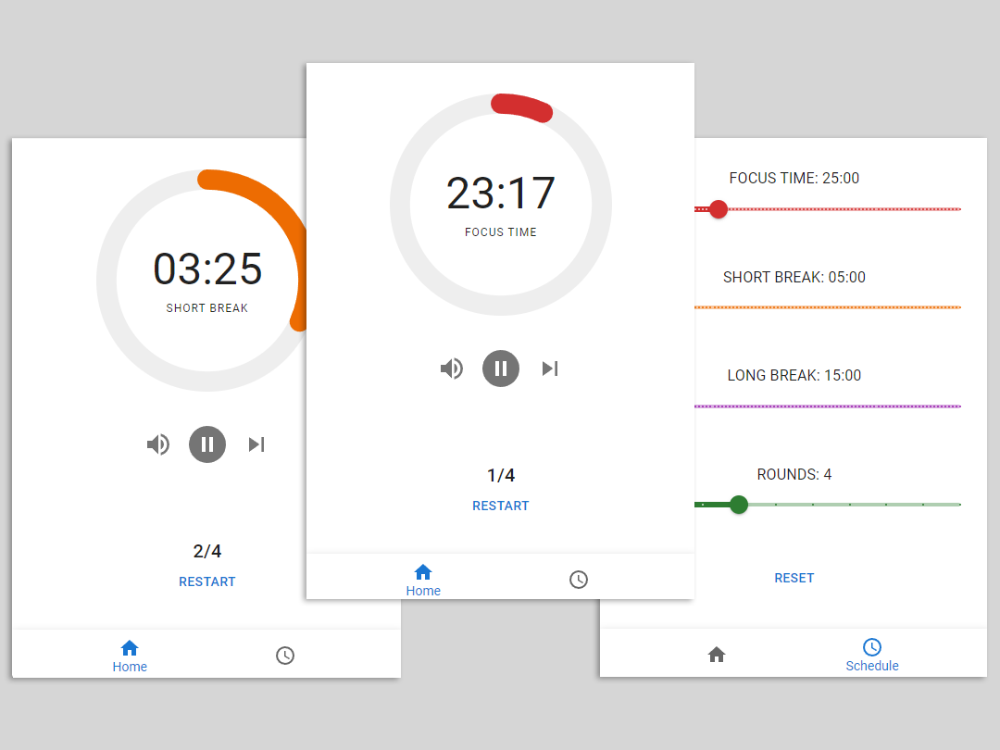

<h1 align="center">PomoCycle</h1>

  <a href="#">Releases</a> • <a href="mailto:dipalosalvatore1@gmail.com">Contact</a>
  

  

**PomoCycle** is an uncomplicated, adjustable Pomodoro timer designed to offer a visually attractive and dependable method for monitoring productivity using the Pomodoro Technique.

As **PomoCycle** is still in the initial phase of its development, we greatly value and welcome any feedback and contributions! 🌱

This app is developed using Wails and React.

# License

MIT © [Salvatore Di Palo](https://github.com/SalvatoreDiPalo)
