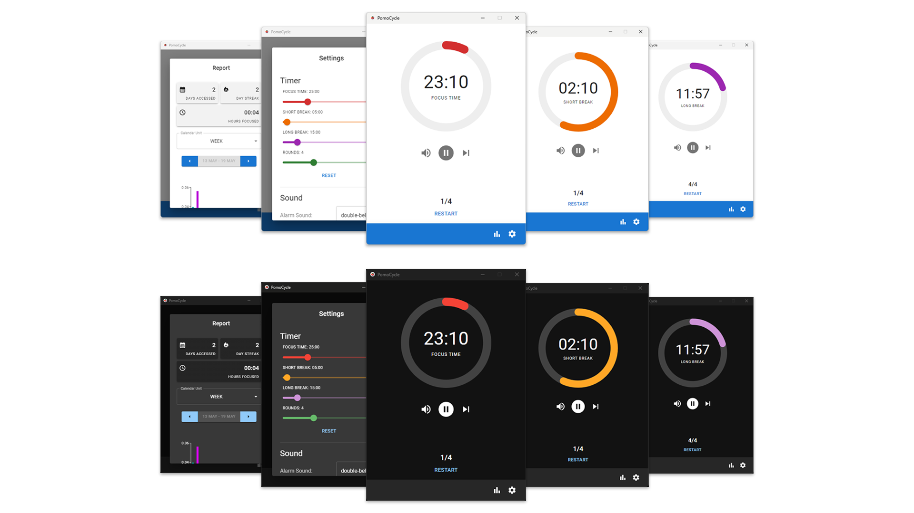

<p align="center">
<h1 align="center">PomoCycle</h1>
</p>
<p align="center">
  <a href="#">Releases</a> • <a href="mailto:dipalosalvatore1@gmail.com">Contact</a>
<br><br>
</p>
<div align="center">
  
</div>

**PomoCycle** is a straightforward, customizable Pomodoro timer designed to provide a visually appealing and reliable way to track productivity using the Pomodoro Technique.

As **PomoCycle** is still in its early development phase, we highly value and welcome any feedback and contributions! 🌱

## Development

PomoCycle is built with [Wails.io](https://wails.io/) and [React](https://react.dev/)

_Please note: Your OS settings may trigger a security alert during installation. This is due to PomoCycle being an unsigned application. For more information, consider researching code-signing for Apple and Microsoft._

### Build Setup

```bash
# install dependencies inside frontend folder
cd ./frontend
npm i

# serve
wails dev

# build PomoCycle for production
wails build
```

# License

MIT © [Salvatore Di Palo](https://github.com/SalvatoreDiPalo)
